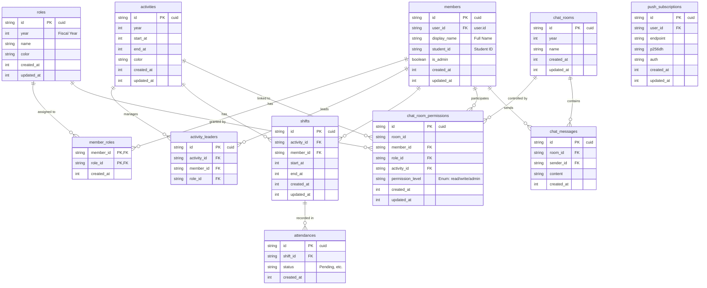

## ユーザー管理
user, session, account [Better Authが要求するテーブル](https://better-auth.com/docs/concepts/database#core-schema)

`members`
	text id PK "cuid"
	text user_id FK "user.id"
	text display_name "本名"
	text student_id NN "学籍番号"
	text is_system_admin NN
	int created_at NN "UNIX時間（ミリ秒）"
	int updated_at NN "UNIX時間（ミリ秒）"

`roles`
	text id PK "cuid"
	int year NN "年度ごとにロールを定義"
	text name NN
	text color NN "#000000"
	int created_at NN "UNIX時間（ミリ秒）"
	int updated_at NN "UNIX時間（ミリ秒）"

`member_roles`
	text member_id PK,FK "members.id"
	text role_id PK,FK "roles.id"
	int created_at NN "UNIX時間（ミリ秒）"

`permissions`
	text id NN "cuid"
`role_permissions`

## シフト管理
`activities`
	text id PK "cuid"
	int year NN
	text place
	text activity_type "いれるかも" 
	int start_at NN "UNIX時間（ミリ秒）"
	int end_at NN "UNIX時間（ミリ秒）"
	text color NN "#000000"
	int created_at NN "UNIX時間（ミリ秒）"
	int updated_at NN "UNIX時間（ミリ秒）"
placeの定義をどこで管理するか？

`activity_leaders`
	text id PK "cuid"
	activity_id FK,NN "activities.id"
	text member_id FK "members.id"
	text role_id FK "roles.id"

`shifts`
	text id PK "cuid"
	text activity_id FK,NN "activities.id"
	text member_id FK "members.id"
	int start_at NN "UNIX時間（ミリ秒）"
	int end_at NN "UNIX時間（ミリ秒）"
	int created_at NN "UNIX時間（ミリ秒）"
	int updated_at NN "UNIX時間（ミリ秒）"

`attendances`
	text id PK "cuid"
	text shift_id FK,NN "shifts.id"
	int created_at NN "UNIX時間（ミリ秒）"

## チャット管理
`chat_rooms`
	text id PK "cuid"
	int year NN
	text name
	int is_disabled NN "0 | 1"
	int created_at NN "UNIX時間（ミリ秒）"
	int updated_at NN "UNIX時間（ミリ秒）"

`chat_room_permissions`
	text id PK "cuid"
	text room_id NN
	text member_id FK "members.id"
	text role_id FK "roles.id"
	text activity_id FK "activities.id"
	text permission_level NN "Enum: 'read_only', 'read_write', 'admin'"
	int created_at NN "UNIX時間（ミリ秒）"
	int updated_at NN "UNIX時間（ミリ秒）"
shiftってpermissionいらないっすよね……

`chat_messages`
	text id PK "cuid"
	text room_id FK,NN "chat_rooms.id"
	text sender_id FK,NN "members.id"
	text content NN
	int created_at NN "UNIX時間（ミリ秒）"
pending: きどく

`push_subscriptions`
	text id PK "cuid"
	text user_id FK,NN "user.id"
	text endpoint NN "PushサービスのURL"
	text p256dh NN "公開鍵"
	text auth NN "認証シークレット"
	int created_at NN "UNIX時間（ミリ秒）"
	int updated_at NN "UNIX時間（ミリ秒）"

ロールの権限管理はどこでやるのか

