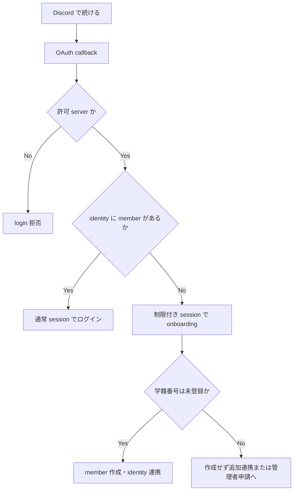
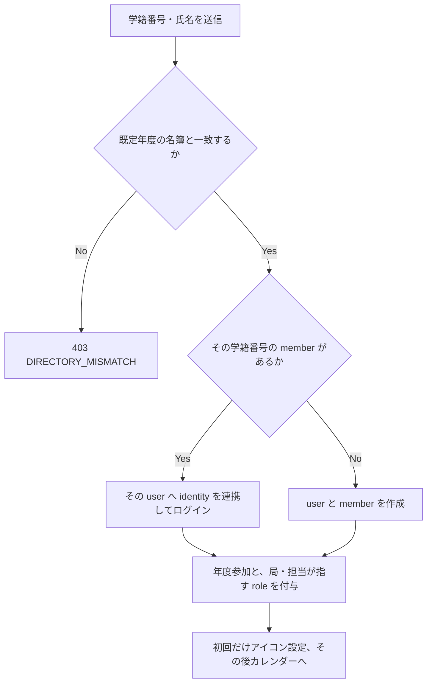

# Architecture

## Goals

- モバイルファーストの SPA と API を責務ごとに保守できるようにする
- Cloudflare Workers と D1 を中心に、小規模運用から始められる構成にする
- API 境界と共有 schema で型安全性を保つ
- 通信断が起きても、閲覧と送信待ちが安全に継続できるようにする

## Status

| Area                        | Status                                               |
| --------------------------- | ---------------------------------------------------- |
| React / Vite 8 / Oxc        | Rolldown build・Oxlint・Oxfmt・型認識lintを導入済み  |
| Valibot / shadcn/ui         | API境界schema・共有UIを導入済み                      |
| D1 binding / Drizzle schema | 認証・年度・希望・シフト schema を実装済み           |
| TanStack Router / Query     | routing と query cache 永続化を構成済み              |
| PWA / offline persistence   | asset cache・query cache・chat送信待ちを実装済み     |
| Better Auth / OAuth         | handler・所属確認・onboarding 実装済み               |
| Durable Objects / chat      | ルーム別SQLite・WebSocketを実装済み                  |
| Web Push / reminders        | 手動の更新通知・開始10分前通知を実装済み             |
| Shift management API / UI   | 年度・役割・希望・割当・タイムライン・出勤を実装済み |
| `packages/shared`           | 認証・シフト・連絡 API schema を実装済み             |

ドキュメント内の「方針」「予定」は、現在の実装済み機能を意味しない。

## Frontend

`apps/web` は React + Vite の SPA とする。

- ファイルベースルーティングに TanStack Router を使う。Vite plugin は `@vitejs/plugin-react` より前に登録する。
- サーバー状態、mutation、offline persistence に TanStack Query を使う。チャット送信はclient生成UUIDを使い、送信待ちと確定済みを同じメッセージ行へ統合する。
- UI 部品は shadcn/ui CLI で管理し、共有可能な部品を `packages/ui` に置く。
- API 入出力は Valibot schema で検証し、共通 schema は `packages/shared` に置く。
- HTTP通信は`apps/web/src/api`へ集約し、React componentはURL、header、response parseを扱わない。
- cache keyは`apps/web/src/data/keys.ts`だけが組み立てる。ルーム単位・参加状態・永続化の
  まとまりも同じ場所で命名し、無効化や削除は名前で参照する。
- チャットの部品は`components/chat`の`message`、`composer`、`image`、`room`に分け、
  会話の外枠(遷移、パネル、配信)だけを直下に置く。
- Service Worker の asset cache と、TanStack Query のデータ cache を別物として設計する。

カレンダーの日、週、月送りは共通のloop carousel adapterを介してEmbla Carouselの
固定7スライドを循環利用する。物理スライドのDOMは維持し、Emblaの`select`で
論理値と物理スロットを確定・再配置する。
`settle`は表示上の移動終了だけを表し、日付確定には使わない。遷移は
`idle`、`dragging`、`animating`の単一モデルで管理し、確定前に次の操作を受けても
スロット割り当てを毎回更新する。ドラッグ中の進捗はReact stateを経由せずCSS変数で
週ヘッダーへ描画する。各carouselはスクロール位置を直接同期せず、選択日だけを共有
する。日のドラッグ中は週ヘッダー上の専用presentation layerへ進捗を描画する。

カレンダーの表示日は、正規URLの`date=YYYY-MM-DD`、利用者・表示年度ごとの
sessionStorage、日本時間の今日の順で解決する。日付の実在性を検証し、不正・重複した
`date`はreplaceでURLから除去する。他のqueryは維持する。日・月送りもreplaceを使い、
履歴を増やさない。表示日・縦スクロール位置・月末移動の基準日を同じsession adapterで
保存し、起動時の取得対象月と画面の初期日を同じ解決関数で決める。

Query cache は `PersistQueryClientProvider` と IndexedDB persister で 24 時間保持する。Service Worker の navigation fallback は `/api/*` を必ず除外し、OAuth callback と API response を app shell へ置き換えない。チャットの下書きと送信待ちは専用のIndexedDB storeに利用者・ルーム別で保存し、画像のBlobも保持する。送信内容を永続化してからアップロードと送信を開始し、client生成UUIDで再送を冪等化する。送信は専用outboxだけを使い、TanStack Queryのmutationは永続化しない。保存形式が異なるcacheやoutboxは破棄し、旧形式への読み替えは行わない。

オフライン起動では、24時間以内にオンライン確認したactive accountだけをローカルの閲覧主体として復元する。ネットワーク障害と401/403またはanonymous responseを区別し、後者では保存済みaccount、利用者Query、停止中mutation、チャットの下書き・送信待ち画像を破棄する。利用者識別には正規化済み学籍番号を使い、別利用者を確認した場合も同様に旧cacheを破棄する。永続化するQueryは本人のassignments、閲覧可能なchat room、message履歴のallowlistとし、管理・名簿・権限・宛先候補は含めない。オフライン状態はローカル閲覧のためだけに使い、server authorizationを代替しない。

通知トグルの設定保存、ブラウザーの許可要求、Push購読登録はそれぞれの責務を分け、権限拒否時はOFFへ確定する。端末ごとの設定は`notification_devices`に保持し、端末IDを利用者別のlocalStorageへ保存する。既存の購読に対応する登録がある場合は同じIDを使用する。起動時は設定を取得し、未確認状態を仮のOFFとして描画しない。許可監視は購読やHTTPの完了を待たずに開始する。Permissions APIのchangeイベントの値を反映し、画面復帰では再取得する。API非対応時はNotification.permissionを使用する。

通知設定のUIはトグルだけとし、許可状態の警告行・再要求ボタン・ヘルプは置かない。トグルは操作直後に切り替わり、設定を順番に保存する。保存失敗時は直前の確定値へ戻して「通知設定を保存できませんでした」と通知する。

初期読み込みでブロックと判定された場合は、保存済みのONを表示せずOFFで確定・保存する。トグルは固定せず操作可能にする。ON操作では許可済みの判定で省略せず、その場で許可要求APIを呼び、許可された場合だけONを保存する。進行中の許可要求は共有して重複させない。拒否・未選択・許可要求の失敗ではOFFに戻して保存し、トーストを出さない。

ブラウザーの許可状態は購読登録のために内部で扱い、OS設定の即時反映は保証しない。許可済みかつONなら購読を登録するが、購読登録は設定操作を待たせない。購読登録で権限拒否が起きた場合もOFFを表示・保存し、拒否自体のトーストは出さない。権限拒否後のOFF保存に失敗してもONには戻さず、保存失敗のみ通知する。操作に伴う登録の通信失敗は「通知の登録に失敗しました」と通知し、ONは維持する。OFFはサーバー配信だけを停止し、ブラウザー購読を解除しない。許可要求は起動・復帰・OFFでは行わない。設定変更・再起動を促すトーストやデバッグ用の表示は設けない。

それ以外のoptimistic updateは、操作ごとにrollback、server responseとの再同期、競合時の表示を定義してから導入する。出勤や遅刻欠勤など時間・状態に依存するmutationは、安全な競合仕様を決めるまでoffline queueへ入れない。

## Backend

`apps/api` は Hono を載せた Cloudflare Worker とする。

- HTTP API は Hono で実装する。
- 永続データは D1、schema と query は Drizzle で管理する。
- 認証と session 管理には Better Auth を使う。Discord OAuth identity と domain 上の `app_users` を分離し、許可対象 server をサーバー側で検証する。
- ルーム単位の WebSocket 接続、順序制御、presence など、単一の調整主体が必要なチャット機能に Durable Objects を使う。通常の CRUD は D1 に置く。
- 新規 Durable Object は SQLite storage を使い、class lifecycle は Wrangler の宣言型 `exports` で管理する。
- `compatibility_date` 2026-08-04以降ではNode.js互換性が既定で有効になるため、
  冗長な`nodejs_compat` flagは追加しない。無効化は依存packageへの影響を確認して
  `no_nodejs_compat`と`no_nodejs_compat_v2`を両方明示する場合だけ行う。

## Toolchain

Vite+を開発toolchainの単一entry pointとし、内包するVite 8・Rolldown・Vitest・Oxlint・Oxfmt・Vite Taskを使う。TypeScriptはnative compilerの7系へ統一する。workspace横断のtest・coverage・TypeScript project checkは`vp run`が依存順序とlocal cacheを管理する。package managerとlockfileの実体はpnpmのまま固定し、installやdependency操作はVite+の統一interfaceから呼び出す。

Cloudflare Vite PluginはVite+のVite Environment上でclientとWorkerを同時にbuildし、local development・preview・deploy成果物をworkerdへ接続する。Cloudflare resource操作と型生成はWranglerを`vp exec`経由で使う。

D1 の read replication は初期要件ではない。必要になった場合は単に有効化するだけでなく、D1 binding の Sessions API と bookmark を使って read-after-write を維持する。

### HTTP API Design

API は `/api` の下にリソース単位で置く。現時点では単一の Web client と API Worker を同時に deploy するため、URL に `/v1` や `/v2` を付けない。互換性のない変更が必要になった場合も、まず additive な変更、移行期間、明示的な廃止を検討し、複数世代の外部 client を並行運用する必要が生じたときだけ versioning を導入する。

主な route:

| Route                                               | Responsibility                                   |
| --------------------------------------------------- | ------------------------------------------------ |
| `/api/health`                                       | Worker・D1のreadiness                            |
| `/api/auth/*`                                       | Better Auth handler                              |
| `/api/account`                                      | 認証状態取得・onboarding                         |
| `/api/admin/*`                                      | system admin専用の管理・監査                     |
| `/api/me/assignments`                               | ログイン中 member の割当一覧                     |
| `/api/me/availability/:year`                        | 本人の希望時間帯                                 |
| `/api/years`                                        | 年度の一覧・作成                                 |
| `/api/years/:year/roles`                            | 年度別 role と機能権限                           |
| `/api/years/:year/roster`                           | 割当候補 member と年度別 role                    |
| `/api/years/:year/memberships`                      | 年度参加者の一覧・有効化・無効化                 |
| `/api/years/:year/availability-submissions`         | 管理者向け希望一覧                               |
| `/api/years/:year/availability-dates`               | 希望を入力できる日付の管理                       |
| `/api/years/:year/activities`                       | 年度内 activity                                  |
| `/api/activities/:activityId`                       | activity と割当                                  |
| `/api/assignments/:assignmentId/attendance`         | 本人の勤怠、責任者の修正・対応済み               |
| `/api/chat/rooms`                                   | 閲覧可能ルームの一覧・作成                       |
| `/api/chat/targets`                                 | 年度内のチャット対象候補                         |
| `/api/chat/rooms/:roomId`                           | 直接リンク用のルーム情報                         |
| `/api/chat/rooms/:roomId/members`                   | 閲覧権限を持つメンバーの表示名                   |
| `/api/chat/rooms/:roomId/attachments`               | 画像の検証・アップロード                         |
| `/api/chat/rooms/:roomId/attachments/:attachmentId` | 認可付き画像配信（原本・縮小）・未送信画像の削除 |
| `/api/chat/rooms/:roomId/messages`                  | メッセージ履歴・送信                             |
| `/api/chat/rooms/:roomId/ws`                        | リアルタイム受信                                 |
| `/api/push/config`                                  | VAPID公開鍵                                      |
| `/api/me/notification-devices`                      | 端末の配信設定・購読情報                         |

アプリ固有の変更系requestは同一originを必須にする。`/api/account`は認証済みだがonboarding前のuserを受け付け、`/api/admin/*`は毎回`system_admin`を再確認する。それ以外のshift APIはonboarding済みmemberを必須にし、対象年度の参加状態または権限を確認する。`/api/auth/*`はBetter Authのhandlerとresponse契約に委譲する。

アプリ固有APIのエラーresponseは`{ "error": { "code", "message" } }`に統一し、UI文言ではなく安定した`code`で分岐する。Better Authが所有する`/api/auth/*`はこのenvelopeの対象外とする。

route名は複数形のresource名を使い、年度がcanonical parentであるcollectionだけを`/years/:year`へ置く。本人固有の希望は`/me/availability/:year`、年度内の割当候補projectionは`roster`とする。assignmentごとに一つだけ存在するattendanceとreportは冪等な`PUT`、reportの状態更新は`PATCH`を使う。

年度参加と年度 role は別の責務とする。通常利用者の年度データ閲覧、本人の希望提出、チャット利用には active な `year_memberships` を必須とし、`member_year_roles` は参加中の利用者へ追加権限を与える。`system_admin` は年度管理を参加状態に依存せず実行できるが、個人として希望提出や private chat を利用する場合は明示的な年度参加を必要とする。

認証後の画面は TanStack Router の pathless layout で保護し、`/calendar`、`/availability`、`/chat`、`/manage`、`/system` に責務を分ける。利用者向けの連絡は個人・役割・活動を対象にできるチャットへ統一する。`/system` は `system_admin`、シフト管理操作はAPIが返す年度別 `canManage` を表示制御に使う。ただし最終的な認可は常にWorker側で再確認する。

個人のチャット対象候補はactiveな年度参加者にだけ公開し、memberのUUIDと表示名に限定する。`shift.manage`を持つ利用者には役割と活動も対象候補として返す。学籍番号を含む管理用`roster`はチャット対象の検索には流用しない。チャットではD1にルームmetadataと対象member・role・activityを置き、各requestで現在の所属からアクセスを再計算する。メッセージ本文と単調増加するsequenceはルームごとのDurable Object SQLiteに置く。送信は認証・認可済みHTTP POST、リアルタイム受信は同一originを検証したHibernation WebSocketとし、client生成UUIDで再送を冪等化する。

Push購読はmemberごと・端末ごとにD1へ保持する。チャット新着は`waitUntil`で通知し、開始前通知は毎分のCron Triggerが「9分超10分以内に開始する割当」を処理する。配送前にassignment・subscription・通知種別の一意なdeliveryをclaimするため、Cronの重複実行で二重送信しない。Push serviceが404/410を返した場合はendpointと鍵を消し、端末の設定と通知履歴は保持する。VAPID秘密鍵はWorker secretだけに置く。

## Authentication Architecture

Better Auth の `user` は認証主体、`account` は Discord OAuth identity、`members` は利用可能な旭祭シフトのアカウントとして扱う。OAuth を完了しても `members` がない `user` は onboarding 中であり、通常 API へアクセスできない。



所属確認:

- Discord は組み込み provider の `getUserInfo` を拡張し、OAuth user token と `identify`、`guilds.members.read` scope を使って、server ID `1047724512873041941` に対する current user member endpoint を確認してから user info を返す。email scope は要求しない。
- 比較対象 ID は `vars`、OAuth client secret と Better Auth secret は secret binding に置く。OAuth access/refresh token を保存する場合は暗号化する。

Better Auth の通常の social sign-up は OAuth callback 中に `user` を作成する。これは domain 上のアカウント作成とはみなさず、`members` 作成前の認証主体として扱う。未完了 user は権限を持たず、期限切れの onboarding user は定期的に削除できる設計にする。

email や学籍番号の一致による暗黙 linking は無効にする。学籍番号衝突時の管理者申請は別 workflow とし、自動で Better Auth の `account.user_id` を付け替えない。Better Auth の account schema は、将来 Notion などを明示的 linking で追加できる形を維持する。

### Directory Sign-in

`DISCORD_OAUTH_ENABLED` が `"false"` のとき、Discord OAuth の代わりに名簿サインインを構成する。`apps/api/src/auth` は composition (`index.ts`)、Discord provider と所属確認 (`discord.ts`)、名簿サインイン plugin (`roster.ts`)、保存してよいプロフィール画像の判定 (`profile-image.ts`) に分かれ、provider は常にどちらか一方だけを構成する。名簿の照会と配置は `services/student-directory.ts` が持つ。



名簿は局（`bureaus`）と担当（`duties`）に正規化し、担当は局に属する。付与する role は名前一致ではなく `role_id` で指し、1人が複数の担当を兼ねられる。名簿 identity は provider `roster`、`account_id` は正規化済み学籍番号とする。名簿 session は再 OAuth に相当する再確認を持たないため、Discord の 7 日ではなく cookie の上限である 400 日とする。氏名は名簿の表記で member と認証 user を更新する。所属確認は名簿で代用し、`affiliation_verifications` は Discord のみが書き込む。member 作成以降の権限、年度参加、API 認可の判定は通常経路と同じものを使う。

プロフィール画像は Discord CDN の 128px WebP に加え、自分の deployment へアップロードした画像を許可する。アップロードは `PUT /api/me/avatar` が Images binding で 128px の正方 WebP に整えて R2 の `avatars/` へ置き、`GET /api/members/:memberId/avatar` が onboarding 済み member にだけ返す。

### Administrative Authorization

`/api/admin/*` は各 request で Better Auth session と `members.access_level` をD1から再確認し、`system_admin` だけに許可する。frontend の表示状態やOAuth profileの値を認可根拠にしない。cookieを使う変更系requestは同一originを必須とし、body size、共有Valibot schema、D1 constraintで入力と競合を検証する。

role変更、全session失効、identity recoveryの承認・拒否は、操作理由を必須にして `admin_audit_logs` と対象更新を1つのD1 batchで実行する。自己role変更、最後の `system_admin` の降格、identity recoveryの自己承認は禁止する。

identity recoveryを承認すると、対象memberの旧Discord identityを外し、申請者の検証済みDiscord identityを対象memberへ移す。申請者と対象memberの全sessionを同じbatchで失効し、次のOAuth loginで新しいidentityから認証させる。学籍番号の一致だけでは承認せず、管理者がアプリ外で本人確認した内容を理由欄へ記録する。自分自身のrecoveryしか承認できる管理者がいない場合は、Cloudflare operatorによるD1上の監査付き復旧を使う。

Notion OAuth は将来拡張とする。追加時は workspace ID `27865ff8-ac56-47e9-9aac-0ed6f3c4d0c5` を候補に、public connection の権限、通常 member が authorize できるか、Enterprise の connection 制限、recovery 方針を改めて確認する。現行 Worker は Notion の credential、binding、provider code を持たない。

## Cloudflare Deployment

Cloudflare Vite PluginがViteのclient生成物とAPI Workerをまとめ、Workers Static Assetsとして同時にdeployする。`not_found_handling: "single-page-application"` でclient routingを処理し、`assets.run_worker_first: ["/api/*"]` でAPI requestだけHonoを先に実行する。

WebとAPIを同一originにすることでCORSと認証cookieの構成を単純にする。localもCloudflare Vite Pluginが単一のVite dev serverとしてclientとWorkerを起動し、個別Wrangler processへのproxyは使わない。

## Packages

| Package                        | Responsibility                                                   |
| ------------------------------ | ---------------------------------------------------------------- |
| `packages/ui`                  | shadcn/ui の共有コンポーネントと global CSS                      |
| `packages/db`                  | Drizzle schema。DB client は Worker の D1 binding から作る       |
| `apps/api/src/app.ts`          | Hono applicationとHTTP routeの合成                               |
| `apps/api/src/index.ts`        | Workerのfetch・scheduled・Durable Object export                  |
| `apps/api/src/auth`            | D1 bindingを使うBetter Auth設定、provider所属確認、名簿sign-in   |
| `apps/api/src/routes`          | HTTP resourceごとのroute                                         |
| `apps/api/src/routes/admin`    | 管理APIの共通認証、read query、監査付きcommand                   |
| `apps/api/src/routes/years`    | 年度をcanonical parentとするresource collection                  |
| `apps/api/src/routes/me`       | ログイン中member固有のresource                                   |
| `apps/api/src/domain`          | WorkerやHonoに依存しない純粋なdomain logic                       |
| `apps/api/src/services`        | Pushなど外部I/Oを伴うapplication service                         |
| `apps/api/src/durable-objects` | Durable Object class                                             |
| `apps/api/test/unit`           | 純粋logicと外部境界adapterのunit test                            |
| `apps/api/test/http`           | Hono request boundaryの挙動test                                  |
| `apps/api/test/storage`        | Durable ObjectとD1 migrationのtest                               |
| `apps/api/test/support`        | migration済みDBとD1 bindingのtest harness                        |
| `apps/web/src/api`             | Valibot検証付きWeb API client                                    |
| `apps/web/src/data`            | query options、cache key、永続化                                 |
| `apps/web/src/lib`             | 領域別の非UI logic(`chat`、`calendar`、`account`、`push`、`app`) |
| `apps/web/src/components`      | 画面部品と、その画面固有の純粋logic                              |
| `packages/shared`              | API schema、共有型、正規化処理                                   |

## Cloudflare Bindings

resource binding と非機密の `vars` は `apps/api/wrangler.jsonc` に定義する。secret の値は設定ファイルへ書かず、local は `.dev.vars`、remote は `wrangler secret put` で管理する。

`wrangler.jsonc` の binding、`compatibility_date`、compatibility flag を変えたら、生成型を更新して commit する。

```bash
vp -C apps/api run cf-typegen
```

Hono では生成された `CloudflareBindings` を `c.env` の型に使う。

```ts
import { Hono } from "hono"

const app = new Hono<{ Bindings: CloudflareBindings }>()

app.get("/health", async (c) => {
  const row = await c.env.shift_app
    .prepare("SELECT 1 AS ok")
    .first<{ ok: number }>()

  return c.json({ ok: row?.ok === 1 })
})

export default app
```

新規の `ChatRoom` class を同じ Worker から呼ぶ構成例:

```jsonc
{
  "durable_objects": {
    "bindings": [{ "name": "CHAT_ROOMS", "class_name": "ChatRoom" }],
  },
  "exports": {
    "ChatRoom": { "type": "durable-object", "storage": "sqlite" },
  },
}
```

Durable Objectのclass lifecycleは宣言型`exports`だけで管理する。`exports`のdeleted / renamed stateはデータ破壊やnamespace変更を伴うため、deploy前に必ず差分を確認する。

## References

2026-08-22 に実装と照合した一次情報。仕様変更が多い項目は実装前にも再確認する。

- [Cloudflare: Node.js compatibility](https://developers.cloudflare.com/workers/runtime-apis/nodejs/)
- [Cloudflare: Durable Object class exports](https://developers.cloudflare.com/durable-objects/reference/durable-objects-migrations/)
- [Cloudflare: Workers Static Assets](https://developers.cloudflare.com/workers/static-assets/)
- [Cloudflare: D1 global read replication](https://developers.cloudflare.com/d1/best-practices/read-replication/)
- [Cloudflare: TypeScript and `wrangler types`](https://developers.cloudflare.com/workers/languages/typescript/)
- [Better Auth: Discord](https://better-auth.com/docs/authentication/discord)
- [Better Auth: Account linking](https://better-auth.com/docs/concepts/users-accounts#account-linking)
- [Discord: OAuth2 scopes](https://docs.discord.com/developers/topics/oauth2#shared-resources-oauth2-scopes)
- [Discord: Get Current User Guild Member](https://docs.discord.com/developers/resources/user#get-current-user-guild-member)
- [TanStack Router: Manual setup](https://tanstack.com/router/latest/docs/installation/manual)
- [TanStack Query: Persisting a QueryClient](https://tanstack.com/query/latest/docs/framework/react/plugins/persistQueryClient)
- [shadcn/ui: Monorepo](https://ui.shadcn.com/docs/monorepo)
- [Vite+: Getting started](https://viteplus.dev/guide/)
- [Vite 8: Getting started](https://v8.vite.dev/guide/)

## 管理刷新の保存境界

年度参加は `year_memberships`、年度をまたぐ利用者は `app_users` が持つ。デフォルト年度と本人の表示年度を分離し、管理画面の年度選択は端末内で保持する。
シフト編集は `shift_slots` と参加者を一括保存し、バージョン比較で同時編集の上書きを防ぐ。無効シフトも重複判定の対象になる。
希望の入力途中は本人専用に自動保存し、提出済みの内容だけを管理画面に公開する。

チャットの実効権限はD1のviewで年度参加、シフト、責任者、明示宛先を合算する。退出後は退出時点までの履歴だけを読める。シフト削除時には削除待ちテーブルを経由し、Durable Objectのメッセージ削除に失敗してもcronで再試行する。
出勤訂正・連絡理由と履歴は本人または現在の責任者・全シフト管理者に限定し、参加者全体には公開しない。

### チャット画面と画像

`/chat`をルーム一覧、`/chat/:roomId`を会話の正規URLとする。roomIdは既存のUUIDを利用する。PCでは親routeに一覧を維持して会話だけを切り替え、スマートフォンでは一覧と会話を別画面として表示する。通知とカレンダーも同じルームURLを参照する。メッセージは吹き出しにせず、同一投稿者の連続投稿をまとめる。入力欄のサイズ変更はメッセージviewportの高さを変えず、末尾の余白で重なりを防ぐ。

画像の原本は非公開R2 bucket `shift-app-chat-images`（`CHAT_IMAGES` binding）に`ルームID/添付ID`で保存し、公開URL・署名付きURLは発行しない。Workerが毎回ログイン、D1のルーム閲覧権限、添付の送信状態を確認してから、`SharedCache`へ原本または長辺640・1280・2400pxの静止WebPを求める。閲覧権限を外れた利用者は過去の画像も見られない。`SharedCache`はImages bindingで縮小した画像と原本を30日保持し、添付とルームのキャッシュタグをメッセージ削除・未送信画像の削除・ルーム削除のときに消す。アップロード直後に640と1280を作る。ブラウザへは`private, no-store`、`nosniff`、same-origin resource policyで返し、原本はアップロード時の名前（空なら日本時間の送信日時）で`Content-Disposition: attachment`とする。

アップロードは1枚20MB・5000万画素、1投稿10枚まで。Images bindingで形式を判定し、JPEG/PNG/WebP/GIF（APNG・アニメーションWebPを含む）は再圧縮せず、EXIFの向き以外・XMP・コメント・未知のchunkを除いて保存する。色の情報とEXIFの向きは残し、JPEGは主画像の終わりまでを保存する。HEIC/HEIF/AVIFは長辺12000px以内・品質92のJPEGに変換する。利用者・ルーム単位の24時間の上限は、一般が100枚・1GB、リーダーとルーム管理者が300枚・3GB、システム管理者が1000枚・5GBで、高いほうを使う。アップロード開始時に数え、送信前に外した画像の分は戻す。画像を選ぶと端末のWorkerで長辺2400のWebPコピーを作り、元より十分小さければコピーを先に送ってメッセージを投稿する（添付の`original`は`false`）。元の画像は投稿後に端末から`PUT /attachments/:id/original`で送り、Durable Objectが置き換えを記録してメッセージの版を上げ、ルームへ変更を知らせる。元の画像が届くまで保存ボタンは出さない。端末が元の画像を失う前には`DELETE /attachments/:id/original`でコピーを元の画像として確定する。

Webは一覧のタイルを並べ方に応じて640か1280で表示し、一覧用の縮小画像とリンクカードの画像だけを端末のCache Storageへ最後の表示から14日・100MBまで保存する。閲覧できなくなったルーム、ログアウト、利用者の変更で消し、オフライン閲覧はアカウント復元の24時間に従う。メモリでは一覧用を64MB、2400pxを10枚、原本を画像詳細で表示中の画像と前後の分だけ保持する。選択した画像は端末で長辺1280pxのプレビューを作って画像レール・送信中・送信直後に使い、サーバーの縮小画像の展開後に差し替える。画像詳細は手元の一覧用画像を先に出して2400pxへ差し替え、保存はスマートフォンでは共有シート、PCではダウンロードとする。ルーム一覧からは上位5ルームの2画面分の画像とリンクカードを先に読む。

添付metadataは各ChatRoomのSQLite schema version 4で管理し、名前と保存形式を持つ。投稿者が所有する未送信画像だけを本文と同一transactionで確定し、未送信の画像は配信しない。24時間以上残った未送信画像はDurable Object alarmで削除し、失敗時は再試行する。ルーム削除時は既存の削除待ちcronから画像と本文を削除する。D1のschema変更はない。

チャットの通常送信では処理状態ラベルを表示せず、同じUUIDの行を送信直後から確定後まで維持する。送信応答をquery cacheへ反映してからoutboxを除去し、WebSocket経由の履歴ともUUIDで重複排除する。再送操作は失敗時に、接続待ちの表示はオフライン時に限る。メッセージは本文・削除・カードが変わるたびにDurable Objectで版を上げ、Webは送信応答とWebSocketの届く順序にかかわらず、手元より新しい版だけを反映する。更新イベントは受け取ったメッセージをそのまま反映し、sequenceに抜けがある場合だけ履歴を取り直す。未読は、既読位置より後にある他人の削除されていないメッセージとし、D1の`chat_message_index`（ルーム・sequence・投稿者・削除済みか）で数える。送信は送信者の既読位置を動かさない。Webは新着の到着と最新までの既読だけを手元で反映し、それ以外はサーバーの数を使う。

リンクカードは本文の最初のリンクだけを対象にする。送信と編集は外部サイトを待たずに確定し、ChatRoomがリンクごとの作業をalarmで処理する。作業はページの説明を取得し、カードの画像を作れた場合だけ画像ありとしてカードをメッセージに保存し、ルームに更新イベントを送る。取得できなければ6分後と30分後に作り直し、それでも失敗すればカードを付けない。作業中に本文が編集されて最初のリンクが変わった場合や、メッセージが削除された場合は、その結果を保存しない。取得はWorkers Cacheを前に置いた`SharedCache` entrypointを通し、ページの説明を24時間（読めなかった場合は5分）、336×336に切り抜いた静止WebPの画像を7日保持する。アプリ自身のドメインはWorkerから取得できないため、assetsから読む。履歴・送信の応答・イベントは保存したカードを含み、Webは保存されたカードどおりに枠を出すので、表示の途中でカードの形は変わらない。ブラウザへはカードの画像を`private, no-store`で返し、Webは一覧用の縮小画像と同じメモリと端末のキャッシュに置く。

Discordのプロフィール画像はOAuthログイン時に認証userへ同期する。アプリの氏名は`app_users.display_name`を使い続け、Discordの表示名更新から分離する。画像URLは本人のaccount応答・閲覧権限を確認したチャットのHTTP応答に含める。本文には画像URLを複製せず、過去のメッセージにも現在のプロフィール画像を合成する。認証userの画像保存時はDiscord CDNのカスタム画像を128pxのWebPで返すURLだけを許可し、任意の外部画像URLとDiscordの既定アイコンは採用しない。カスタム画像がない場合はログイン時に保存済み画像も消去し、URLが未取得または読み込めない場合と同様に名前の先頭文字を表示する。

### Mobile chat navigation

チャットは`/chat`を一覧、`/chat/:roomId`を会話として扱い、共通のChatPageが
一覧と直前の会話を保持する。モバイルはカレンダーと同じEmbla Carouselで、循環しない
2パネルの水平移動を扱い、PCは同じDOMを2列に配置する。指への追従、アニメーションの
中断・再開、タッチ操作の判定はEmblaに任せる。一覧の検索・スクロール、
会話のスクロール・下書きを遷移で作り直さない。非表示のパネルはinertにし、
非表示の会話はWebSocket購読と既読更新を停止する。

ルーム一覧から開いた会話はhistory stateに戻り先の種別を記録し、戻る操作で
既存の一覧履歴へ戻す。直接開いた会話では一覧へreplaceする。スワイプも戻るリンクも
同じnavigation操作を使い、ブラウザーの戻る・進むとパネル位置を同期する。
`ChatNavigation`が選択中・直前のルームと履歴操作を一元管理し、history locationの
購読を通してブラウザーの戻る・進むを反映する。操作時に表示先を更新し、非同期loaderや
history.backの完了を待たない。履歴を戻している途中の次の操作は最後の表示先として保持し、
BACK通知で履歴移動が完了した後に反映する。古い履歴の完了で表示先を上書きしない。
操作可能なパネルはEmblaの選択と同時に切り替え、history.backの完了を待たせない。
DOMのinertとフォーカス移動も同じadapterが担当し、Reactの別条件で上書きしない。
一覧へ戻った直後の再タップも同じnavigationへ渡す。
`useChatPanels`はEmblaの選択とURLの同期、一覧の視差表示だけを担当する。
ルート変更でEmblaやイベント購読を作り直さず、既に選択済みのパネルへの履歴更新では
scrollToを呼ばない。これにより、前の履歴更新中に始まった次の操作を維持する。
タップは通常のリンククリックへ任せ、独自のクリック抑止や速度・距離の判定は持たない。
画面両端24pxはOSの操作用に残し、フォーム・ボタン・選択中のテキストからは
スワイプを始めない。縦スクロールとピンチズームを維持し、motion reductionにも従う。

ボトムナビはアイコン32px・間隔4px・ラベル14pxと上下の余白で68pxを基本とし、境界線1pxと端末のsafe areaを加える。選択中のアイコンに薄い無彩色の丸い背景を付ける。
モバイルのチャットでは一覧パネルにボトムナビを含め、会話パネルには置かない。
一覧とナビを一緒に水平移動させ、ルーム遷移の途中で会話の高さやmainの余白を
切り替えない。フォーカスはナビの表示条件に含めない。PCのサイドバーは常に維持する。
キーボード表示時は`interactive-widget=resizes-content`でレイアウト自体を縮める。
非対応ブラウザーも含め、useChatViewportがVisualViewportの高さ・位置を一元管理し、キーボード表示で
入力欄が隠れないよう表示領域を追従させる。この処理は入力欄の段組みと独立させる。チャット表示中は文書・shell・パネルの
外枠を`overflow: clip`とし、メッセージ領域と一覧それぞれの内側だけがスクロールする。
`overflow: hidden`による外枠のプログラム可能なスクロール領域も作らない。
入力欄の1行時の上端は、一覧のボトムナビ上端と同じ高さに揃える。
ボトムナビの共通高さから入力欄の通常時の高さ50px（本文32px・上下余白16px・枠線2px）を
引いた位置に下端を固定し、展開時は上へ伸ばす。safe areaはパネル側で確保し、
ボタンは32pxのまま維持する。

会話のスクロール領域はパネルの左右端まで広げ、下端は入力欄の上で区切る。添付レールは会話に重ね、背景は下半分から上へ透明にする。末尾には添付レールの高さ分の余白を置き、最新の本文が隠れないようにする。本文と入力欄に16pxの左右余白を持たせる。
会話と画像詳細の説明欄はスクロールバーを表示しない。
`useMessages`は取得・購読・既読通信、`useMessageScroll`と`MessageScroll`は描画位置を所有する。
確定済みと送信待ちを統合した描画後、paint前に位置を確定する。送信時の追従は端末保存や
通信の完了を待たない。本文・入力欄・表示領域のサイズ変更も同じ制御へ渡し、最新を見ていれば
下端、過去を読んでいれば表示中のメッセージとその画面内位置を維持する。ブラウザーの
自動アンカー補正と重ねない。ルームの復帰位置は最大20件保持する。
位置の補正はメッセージの変更・領域のリサイズ時だけ行い、ボタンの表示変更では行わない。
移動先が現在位置と同じならscrollToを呼ばず、ブラウザーのドラッグ・慣性スクロールを維持する。
下端付近を上へ離れている間は自動追従へ復帰させない。
最新への追従とジャンプボタンの表示を分け、半画面（最低160px）離れたらボタンを表示し、
その半分以内へ戻ったら隠す。下矢印の真円ボタンは入力欄の右上に16pxの間隔で置く。
明示操作はnative smooth scrollを使い、ユーザーの操作で中断できる。motion reductionでは即時移動する。
画像追加は押下の背景・縮小で応答し、画像用のOS選択画面を呼び出す。写真ライブラリの包括権限は要求しない。
端末で取得できる画像寸法は下書き・送信待ちに保持し、アップロード前後で表示領域を予約する。
端末がデコードできない形式は仮の領域を使い、サーバーで取得した寸法を反映する。
送信は右向きのSendHorizontalを使い、本文も添付もない場合は領域を維持して非表示にする。

入力欄はモバイルではフォーカス時、PCでは本文が1行を超えた時に本文と操作を
上下に分ける。モバイルの送信後もフォーカス中は展開を維持し、入力欄からフォーカスが外れたら本文が1行に収まる場合は畳む。
画像は入力欄の外の横スクロールレールに置き、画像操作で入力欄を自動フォーカスしない。
タッチ端末では入力欄はキーボードが開いている間だけフォーカスを持ち、キーボードが閉じたらフォーカスを外す。フォーカスが残ったままだと、送信などの操作の後の画面変化でブラウザーがキーボードを開き直すため。キーボードの開閉は、同じ幅で観測した最大の表示領域の高さから120px以上縮んでいるかで判定する。非表示の計測要素で遷移先の折り返し・高さを
決定し、編集要素の幅・padding・高さを途中値で計測しない。外枠の高さと本文の平行移動を
同じ200msで動かし、文字の拡縮・フェードやpaddingの連続変更は行わない。
初期表示とmotion reductionではアニメーションを行わない。

カレンダーとチャットの縦スクロールは先頭でブラウザーへ連鎖させ、ブラウザーのpull-to-refreshを許可する。横方向だけoverscrollを制限し、横スワイプの判定は縦操作や短いタップを消費しない。端末・ブラウザーが提供する更新動作を利用し、独自の更新ジェスチャーは重ねない。

会話を開く操作でルーム情報と直近の履歴を並行取得する。PCのhover/focusでそのルームだけ先行取得し、全ルームの履歴は先読みしない。初回も一覧のルーム名をヘッダーへ渡し、通常の読み込みテキストで画面を置き換えない。

PWAの更新はcontrollerchangeで切り替えを確認してから再読み込みする。他タブで更新済みの通知は現在のregistrationを確認し、古い通知に対する操作でも復帰できるようにする。registration取得・更新・切り替え全体を15秒で制限し、失敗時はトーストと再試行可能なボタンに戻す。

画面を追加する操作には`packages/ui`の`ResponsivePage`を使用する。モバイルではボトムナビを覆う全画面、PCではモーダルとして表示する。ヘッダー・本文のスクロール領域を共有し、フォームと業務処理は利用側に置く。開閉はURLに対応する`open`で制御し、UI基盤が退出アニメーションの完了まで内容を保持する。閉じた後はフォームを破棄し、再表示時に候補を取得する。表示時は画面の枠へフォーカスし、入力欄の操作なしにキーボードを開かない。

### データの準備と更新

`apps/web/src/data` がリソース別の query options、cache key、起動・遷移時の準備、更新結果の反映を所有する。
画面と先読みは同じキーと鮮度を使い、重複リクエストをまとめる。年度情報を準備してから
直近のカレンダー、本人の希望、ルーム一覧を取得する。管理情報は管理可能な年度だけを対象とし、
全利用者や操作履歴は該当画面への遷移で取得する。表示できるデータがあれば維持したまま再検証する。
全ルームの会話履歴は起動時に取得せず、ルームを開く意図がある時だけ取得する。

チャットの送信応答とWebSocketは同じキャッシュ更新を使用し、UUIDで重複を除く。
連続した新着は直接反映し、シーケンス欠落・未知の投稿者のプロフィール・接続再開時はHTTPで補完する。
既読更新はルーム詳細と一覧へ反映する。ミュートは即時反映し、通信は順番に送り、最新の意図が
失敗した時だけ直前の確定値へ戻す。年度選択は即時反映し、失敗時に元へ戻す。
希望の自動保存・提出はサーバー応答をキャッシュへ反映する。権限変更はサーバー確定後に関連データを再検証する。

永続キャッシュは既存の許可リストを維持し、直近20ルームの履歴を各3ページ、ルーム詳細20件、
年度別の一覧6件、カレンダー6か月分まで保存する。古いページの続きはカーソルから取得できる。
管理情報と名簿は永続化しない。送信待ち・下書きの独立した保存と、ログアウト時の消去は維持する。

更新通知はService Workerの`updatefound`と既存の`installing` / `waiting`を監視し、
新版の検出時点で表示する。初回インストールは更新として通知しない。起動時、表示中の5分間隔、
フォーカス・オンライン復帰時に共通の確認処理を呼び、進行中の確認を共有し、1分以内の重複を抑制する。
更新ボタンはインストール中でも押せるが、インストール完了とcontroller変更を待ってから再読み込みする。
他タブでの有効化だけを理由に編集中のページを自動再読み込みしない。

PWAのmanifestは`minimal-ui`を指定する。ChromeのWebappActionsNotificationManagerはこのdisplay modeで
URLコピー用の常駐通知を生成しない。通常のWeb Push購読・通知・アプリアイコンは独立して維持する。
インストール済みWebAPKへのmanifest反映は、Service Workerの更新とは別にブラウザーが管理する。
