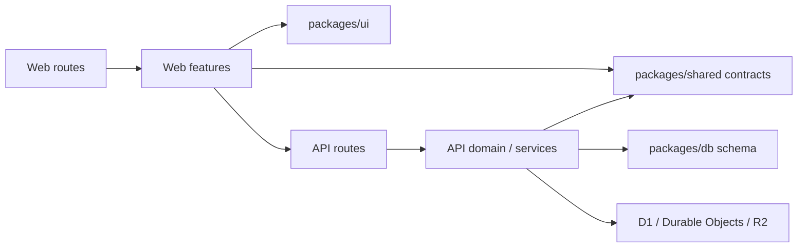

# Architecture

## 全体

このリポジトリはモバイル向けシフト管理 PWA の pnpm monorepo。`vp` が Vite、テスト、lint、build の入口であり、Cloudflare Vite plugin が React SPA と Hono Worker を一緒に構築する。Workers Static Assets が Web を配信し、Worker が同じ origin の `/api` を担当する。保存先は D1、ルームごとの調整は SQLite Durable Object、非公開画像は R2 と Images binding を使う。

```text
apps/
  web/src/
    routes/          URL・loader・画面の構成
    app/             起動、レイアウト、共通 query と接続
    features/        account, calendar, chat, management, shifts など
    components/      機能に依存しない画面部品
    lib/             機能に依存しないブラウザー処理
  api/src/
    app.ts           Hono の入口、認証、共通 middleware
    routes/          リソースの組み立て
    features/        機能別の routes, domain, services, durable-objects
    auth/            Better Auth と所属確認
    lib/             HTTP 境界、エラーと共通 Worker 処理
packages/
  shared/src/contracts/  Web・API 間の Valibot 契約
  shared/src/lib/        両側で使う純粋ロジック
  db/src/schema/        領域別 Drizzle table 定義
  ui/                   共有 shadcn/ui とデザイントークン
```

## 所有者と依存方向

Web の `routes` は URL に固有の処理と機能の合成を担当する。業務画面、HTTP client、query、局所状態は `features/<name>` が所有する。`app` は画面をまたぐ起動・認証済みレイアウト・cache・接続のライフサイクルを所有する。`components` と `lib` は機能から参照できるが、逆向きには参照しない。機能間参照は循環させず、上位画面の合成は route または上位機能に寄せる。共通 UI は `packages/ui` へ置く。

管理画面の `management` は画面の組み立てと選択年度を所有する。シフト一覧・編集とその表示状態は `shifts`、希望の受付日程と提出状況は `availability` が所有する。カレンダーはこれらの機能が公開する query と操作を使って本人の画面を組み立てる。

チャットでは `lib/store.ts` が端末に残す下書き・送信待ちと画像転送の順序を調整し、`lib/storage.ts` が IndexedDB への保存を担当する。`data` はサーバーの query・cache 更新・会話の先読みを所有し、画面の hook と component はそれらを利用する。`app` は起動と接続のライフサイクルを組み立て、チャット固有の cache 更新はチャット機能へ委ねる。

API は `routes/api.ts` と `routes/me`、`routes/years` が公開 URL を組み立てる。機能別 `routes` は入力、認証・認可、HTTP 応答を担当する。`domain` は純粋な規則、`services` は D1・Push・画像などの I/O、`durable-objects` はチャットの順序制御と接続を担当する。共通境界は `auth` と `lib` が所有する。API テストは `apps/api/test` に置く。

チャットの Durable Object では `ChatRoom` がアクセスの再確認、保存操作の順序、添付・カード・通知の調整を担う。`chat-messages.ts` はルーム内のメッセージ表の読み書きと返信・添付を含む公開データへの変換を所有する。Durable Object の識別子と既存の SQLite migration は変えない。

`packages/shared` の契約は Web の応答検証と API の入力検証で共有する。DB の table 定義と HTTP 契約は別の境界であり、DB table をそのまま外部へ公開しない。`packages/db/src/schema.ts` は領域別 table の公開入口、SQL migration は `apps/api/migrations` に置く。認証用 Better Auth table は `packages/db/src/auth-schema.ts` に置く。



## 実行時の境界

認証は Better Auth、所属確認と onboarding は Worker 側で扱う。通常 API では認証済みの member を必須にし、対象年度への参加・権限をサーバーで確認する。管理 API は `system_admin` を毎回確認する。変更系のアプリ API は同一 origin を要求する。Web の表示条件は認可の代わりにならない。

アプリ API の失敗は `{ "error": { "code", "message" } }` に統一する。Better Auth の `/api/auth/*` はその契約外。route は `/api` 以下の複数形の resource 名を基本とし、本人固有のものは `/me` に置く。現状は Web と Worker を同時に構築するため API URL に版を付けない。旧画面との共存、保存形式の変更、一時的な互換は [compatibility.md](compatibility.md) で扱う。

TanStack Query の server state と IndexedDB の永続 cache、チャットの outbox、Service Worker の asset cache は独立した保存領域。WebSocket の `/api/events` はチャットと他の変更通知を運び、受信後に認可された HTTP から必要なデータを再取得する。チャットのルーム単位の状態は Durable Object が管理する。細かな画面遷移、cache、通知の動作は [実装済み画面・同期の設計](design/runtime-behavior.md) に記す。

DB table の役割は [database.md](database.md)、要件は [requirements.md](requirements.md)、実行手順は [CONTRIBUTING.md](../CONTRIBUTING.md) と [setup.md](setup.md)、実装規約は [conventions.md](conventions.md) を参照。重要な設計判断の背景は [ADR](adr/README.md) に残す。
