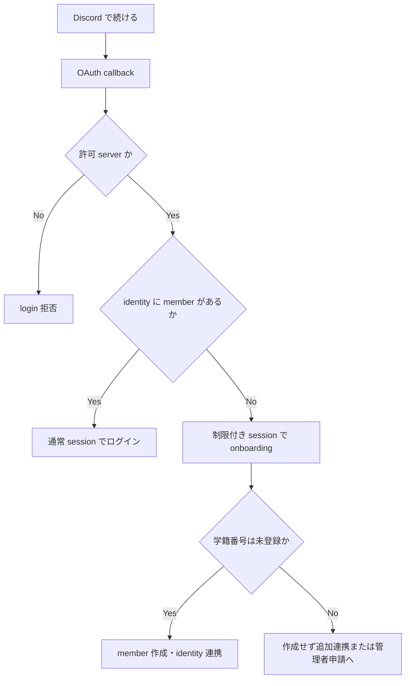

# Architecture

## Goals

- モバイルファーストの SPA と API を責務ごとに保守できるようにする
- Cloudflare Workers と D1 を中心に、小規模運用から始められる構成にする
- API 境界と共有 schema で型安全性を保つ
- 通信断が起きても、閲覧と送信待ちが安全に継続できるようにする

## Status

| Area                        | Status                                               |
| --------------------------- | ---------------------------------------------------- |
| React / Vite 8 / Oxc        | Rolldown build・Oxlint・Oxfmt・型認識lintを導入済み  |
| Valibot / shadcn/ui         | API境界schema・共有UIを導入済み                      |
| D1 binding / Drizzle schema | 認証・年度・希望・シフト schema を実装済み           |
| TanStack Router / Query     | routing と query cache 永続化を構成済み              |
| PWA / offline persistence   | asset cache・query cache・chat送信待ちを実装済み     |
| Better Auth / OAuth         | handler・所属確認・onboarding 実装済み               |
| Durable Objects / chat      | ルーム別SQLite・WebSocketを実装済み                  |
| Web Push / reminders        | 割当時・開始10分前通知を実装済み                     |
| Shift management API / UI   | 年度・役割・希望・割当・タイムライン・出勤を実装済み |
| `packages/shared`           | 認証・シフト・連絡 API schema を実装済み             |

ドキュメント内の「方針」「予定」は、現在の実装済み機能を意味しない。

## Frontend

`apps/web` は React + Vite の SPA とする。

- ファイルベースルーティングに TanStack Router を使う。Vite plugin は `@vitejs/plugin-react` より前に登録する。
- サーバー状態、mutation、offline persistence に TanStack Query を使う。optimistic update は今後導入する。
- UI 部品は shadcn/ui CLI で管理し、共有可能な部品を `packages/ui` に置く。
- API 入出力は Valibot schema で検証し、共通 schema は `packages/shared` に置く。
- HTTP通信は`apps/web/src/api`へ集約し、React componentはURL、header、response parseを扱わない。
- Service Worker の asset cache と、TanStack Query のデータ cache を別物として設計する。

Query cache は `PersistQueryClientProvider` と IndexedDB persister で 24 時間保持する。Service Worker の navigation fallback は `/api/*` を必ず除外し、OAuth callback と API response を app shell へ置き換えない。チャット送信は安定したmutation key、再構築可能な既定`mutationFn`、client生成UUIDを使い、オフラインで停止したmutationを再読み込み後に再開する。

optimistic updateは現時点では未実装とし、操作ごとにrollback、server responseとの再同期、競合時の表示を定義してから導入する。出勤や遅刻欠勤など時間・状態に依存するmutationは、安全な競合仕様を決めるまでoffline queueへ入れない。

## Backend

`apps/api` は Hono を載せた Cloudflare Worker とする。

- HTTP API は Hono で実装する。
- 永続データは D1、schema と query は Drizzle で管理する。
- 認証と session 管理には Better Auth を使う。Discord OAuth identity と domain 上の `members` を分離し、許可対象 server をサーバー側で検証する。
- ルーム単位の WebSocket 接続、順序制御、presence など、単一の調整主体が必要なチャット機能に Durable Objects を使う。通常の CRUD は D1 に置く。
- 新規 Durable Object は SQLite storage を使い、class lifecycle は Wrangler の宣言型 `exports` で管理する。
- `compatibility_date` 2026-08-04以降ではNode.js互換性が既定で有効になるため、
  冗長な`nodejs_compat` flagは追加しない。無効化は依存packageへの影響を確認して
  `no_nodejs_compat`と`no_nodejs_compat_v2`を両方明示する場合だけ行う。

## Toolchain

Vite+を開発toolchainの単一entry pointとし、内包するVite 8・Rolldown・Vitest・Oxlint・Oxfmt・Vite Taskを使う。TypeScriptはnative compilerの7系へ統一する。workspace横断のtest・coverage・TypeScript project checkは`vp run`が依存順序とlocal cacheを管理する。package managerとlockfileの実体はpnpmのまま固定し、installやdependency操作はVite+の統一interfaceから呼び出す。

Cloudflare Vite PluginはVite+のVite Environment上でclientとWorkerを同時にbuildし、local development・preview・deploy成果物をworkerdへ接続する。Cloudflare resource操作と型生成はWranglerを`vp exec`経由で使う。

D1 の read replication は初期要件ではない。必要になった場合は単に有効化するだけでなく、D1 binding の Sessions API と bookmark を使って read-after-write を維持する。

### HTTP API Design

API は `/api` の下にリソース単位で置く。現時点では単一の Web client と API Worker を同時に deploy するため、URL に `/v1` や `/v2` を付けない。互換性のない変更が必要になった場合も、まず additive な変更、移行期間、明示的な廃止を検討し、複数世代の外部 client を並行運用する必要が生じたときだけ versioning を導入する。

主な route:

| Route                                       | Responsibility                   |
| ------------------------------------------- | -------------------------------- |
| `/api/health`                               | Worker・D1のreadiness            |
| `/api/auth/*`                               | Better Auth handler              |
| `/api/account`                              | 認証状態取得・onboarding         |
| `/api/admin/*`                              | system admin専用の管理・監査     |
| `/api/me/timeline`                          | ログイン中 member の割当一覧     |
| `/api/me/availability/:year`                | 本人の希望時間帯                 |
| `/api/years`                                | 年度の一覧・作成                 |
| `/api/years/:year/roles`                    | 年度別 role と機能権限           |
| `/api/years/:year/roster`                   | 割当候補 member と年度別 role    |
| `/api/years/:year/memberships`              | 年度参加者の一覧・有効化・無効化 |
| `/api/years/:year/availability-submissions` | 管理者向け希望一覧               |
| `/api/years/:year/activities`               | 年度内 activity                  |
| `/api/activities/:activityId`               | activity と割当                  |
| `/api/assignments/:assignmentId`            | 個別割当の取消                   |
| `/api/assignments/:assignmentId/attendance` | 本人の出勤記録                   |
| `/api/assignments/:assignmentId/report`     | 本人の遅刻・欠勤連絡             |
| `/api/years/:year/reports`                  | 管理者向け連絡一覧               |
| `/api/reports/:reportId`                    | 連絡状態の更新                   |
| `/api/years/:year/announcements`            | 年度別事務連絡の一覧・作成       |
| `/api/chat/rooms`                           | 閲覧可能ルームの一覧・作成       |
| `/api/chat/rooms/:roomId/messages`          | メッセージ履歴・送信             |
| `/api/chat/rooms/:roomId/ws`                | リアルタイム受信                 |
| `/api/push/config`                          | VAPID公開鍵                      |
| `/api/push/subscriptions`                   | 端末のPush購読登録・解除         |

アプリ固有の変更系requestは同一originを必須にする。`/api/account`は認証済みだがonboarding前のuserを受け付け、`/api/admin/*`は毎回`system_admin`を再確認する。それ以外のshift APIはonboarding済みmemberを必須にし、対象年度の参加状態または権限を確認する。`/api/auth/*`はBetter Authのhandlerとresponse契約に委譲する。

アプリ固有APIのエラーresponseは`{ "error": { "code", "message" } }`に統一し、UI文言ではなく安定した`code`で分岐する。Better Authが所有する`/api/auth/*`はこのenvelopeの対象外とする。

route名は複数形のresource名を使い、年度がcanonical parentであるcollectionだけを`/years/:year`へ置く。本人固有の希望は`/me/availability/:year`、年度内の割当候補projectionは`roster`とする。assignmentごとに一つだけ存在するattendanceとreportは冪等な`PUT`、reportの状態更新は`PATCH`を使う。

年度参加と年度 role は別の責務とする。通常利用者の年度データ閲覧、本人の希望提出、チャット利用には active な `year_memberships` を必須とし、`member_year_roles` は参加中の利用者へ追加権限を与える。`system_admin` は年度管理を参加状態に依存せず実行できるが、個人として希望提出や private chat を利用する場合は明示的な年度参加を必要とする。

認証後の画面は TanStack Router の pathless layout で保護し、`/timeline`、`/availability`、`/notices`、`/chat`、`/manage`、`/system` に責務を分ける。`/system` は `system_admin`、シフト管理操作はAPIが返す年度別 `canManage` を表示制御に使う。ただし最終的な認可は常にWorker側で再確認する。

チャットではD1にルームmetadataと対象member・role・activityを置き、各requestで現在の所属からアクセスを再計算する。メッセージ本文と単調増加するsequenceはルームごとのDurable Object SQLiteに置く。送信は認証・認可済みHTTP POST、リアルタイム受信は同一originを検証したHibernation WebSocketとし、client生成UUIDで再送を冪等化する。

Push購読はmemberごと・端末ごとにD1へ保持する。新規割当後は`waitUntil`で即時通知し、開始前通知は毎分のCron Triggerが「9分超10分以内に開始する割当」を処理する。配送前にassignment・subscription・通知種別の一意なdeliveryをclaimするため、Cronの重複実行で二重送信しない。Push serviceが404/410を返した購読は削除する。VAPID秘密鍵はWorker secretだけに置く。

## Authentication Architecture

Better Auth の `user` は認証主体、`account` は Discord OAuth identity、`members` は利用可能なシフトアプリアカウントとして扱う。OAuth を完了しても `members` がない `user` は onboarding 中であり、通常 API へアクセスできない。



所属確認:

- Discord は組み込み provider の `getUserInfo` を拡張し、OAuth user token と `identify`、`guilds.members.read` scope を使って、server ID `1047724512873041941` に対する current user member endpoint を確認してから user info を返す。email scope は要求しない。
- 比較対象 ID は `vars`、OAuth client secret と Better Auth secret は secret binding に置く。OAuth access/refresh token を保存する場合は暗号化する。

Better Auth の通常の social sign-up は OAuth callback 中に `user` を作成する。これは domain 上のアカウント作成とはみなさず、`members` 作成前の認証主体として扱う。未完了 user は権限を持たず、期限切れの onboarding user は定期的に削除できる設計にする。

email や学籍番号の一致による暗黙 linking は無効にする。学籍番号衝突時の管理者申請は別 workflow とし、自動で Better Auth の `account.user_id` を付け替えない。Better Auth の account schema は、将来 Notion などを明示的 linking で追加できる形を維持する。

### Administrative Authorization

`/api/admin/*` は各 request で Better Auth session と `members.access_level` をD1から再確認し、`system_admin` だけに許可する。frontend の表示状態やOAuth profileの値を認可根拠にしない。cookieを使う変更系requestは同一originを必須とし、body size、共有Valibot schema、D1 constraintで入力と競合を検証する。

role変更、全session失効、identity recoveryの承認・拒否は、操作理由を必須にして `admin_audit_logs` と対象更新を1つのD1 batchで実行する。自己role変更、最後の `system_admin` の降格、identity recoveryの自己承認は禁止する。

identity recoveryを承認すると、対象memberの旧Discord identityを外し、申請者の検証済みDiscord identityを対象memberへ移す。申請者と対象memberの全sessionを同じbatchで失効し、次のOAuth loginで新しいidentityから認証させる。学籍番号の一致だけでは承認せず、管理者がアプリ外で本人確認した内容を理由欄へ記録する。自分自身のrecoveryしか承認できる管理者がいない場合は、Cloudflare operatorによるD1上の監査付き復旧を使う。

Notion OAuth は将来拡張とする。追加時は workspace ID `27865ff8-ac56-47e9-9aac-0ed6f3c4d0c5` を候補に、public connection の権限、通常 member が authorize できるか、Enterprise の connection 制限、recovery 方針を改めて確認する。現行 Worker は Notion の credential、binding、provider code を持たない。

## Cloudflare Deployment

Cloudflare Vite PluginがViteのclient生成物とAPI Workerをまとめ、Workers Static Assetsとして同時にdeployする。`not_found_handling: "single-page-application"` でclient routingを処理し、`assets.run_worker_first: ["/api/*"]` でAPI requestだけHonoを先に実行する。

WebとAPIを同一originにすることでCORSと認証cookieの構成を単純にする。localもCloudflare Vite Pluginが単一のVite dev serverとしてclientとWorkerを起動し、個別Wrangler processへのproxyは使わない。

## Packages

| Package                        | Responsibility                                             |
| ------------------------------ | ---------------------------------------------------------- |
| `packages/ui`                  | shadcn/ui の共有コンポーネントと global CSS                |
| `packages/db`                  | Drizzle schema。DB client は Worker の D1 binding から作る |
| `apps/api/src/app.ts`          | Hono applicationとHTTP routeの合成                         |
| `apps/api/src/index.ts`        | Workerのfetch・scheduled・Durable Object export            |
| `apps/api/src/auth`            | D1 bindingを使うBetter Auth設定、provider所属確認          |
| `apps/api/src/routes`          | HTTP resourceごとのroute                                   |
| `apps/api/src/routes/admin`    | 管理APIの共通認証、read query、監査付きcommand             |
| `apps/api/src/routes/years`    | 年度をcanonical parentとするresource collection            |
| `apps/api/src/routes/me`       | ログイン中member固有のresource                             |
| `apps/api/src/domain`          | WorkerやHonoに依存しない純粋なdomain logic                 |
| `apps/api/src/services`        | Pushなど外部I/Oを伴うapplication service                   |
| `apps/api/src/durable-objects` | Durable Object class                                       |
| `apps/api/test/unit`           | 純粋logicと外部境界adapterのunit test                      |
| `apps/api/test/http`           | Hono request boundaryの挙動test                            |
| `apps/web/src/api`             | Valibot検証付きWeb API client                              |
| `packages/shared`              | API schema、共有型、正規化処理                             |

## Cloudflare Bindings

resource binding と非機密の `vars` は `apps/api/wrangler.jsonc` に定義する。secret の値は設定ファイルへ書かず、local は `.dev.vars`、remote は `wrangler secret put` で管理する。

`wrangler.jsonc` の binding、`compatibility_date`、compatibility flag を変えたら、生成型を更新して commit する。

```bash
vp -C apps/api run cf-typegen
```

Hono では生成された `CloudflareBindings` を `c.env` の型に使う。

```ts
import { Hono } from "hono"

const app = new Hono<{ Bindings: CloudflareBindings }>()

app.get("/health", async (c) => {
  const row = await c.env.shift_app
    .prepare("SELECT 1 AS ok")
    .first<{ ok: number }>()

  return c.json({ ok: row?.ok === 1 })
})

export default app
```

新規の `ChatRoom` class を同じ Worker から呼ぶ構成例:

```jsonc
{
  "durable_objects": {
    "bindings": [{ "name": "CHAT_ROOMS", "class_name": "ChatRoom" }],
  },
  "exports": {
    "ChatRoom": { "type": "durable-object", "storage": "sqlite" },
  },
}
```

Durable Objectのclass lifecycleは宣言型`exports`だけで管理する。`exports`のdeleted / renamed stateはデータ破壊やnamespace変更を伴うため、deploy前に必ず差分を確認する。

## References

2026-08-22 に実装と照合した一次情報。仕様変更が多い項目は実装前にも再確認する。

- [Cloudflare: Node.js compatibility](https://developers.cloudflare.com/workers/runtime-apis/nodejs/)
- [Cloudflare: Durable Object class exports](https://developers.cloudflare.com/durable-objects/reference/durable-objects-migrations/)
- [Cloudflare: Workers Static Assets](https://developers.cloudflare.com/workers/static-assets/)
- [Cloudflare: D1 global read replication](https://developers.cloudflare.com/d1/best-practices/read-replication/)
- [Cloudflare: TypeScript and `wrangler types`](https://developers.cloudflare.com/workers/languages/typescript/)
- [Better Auth: Discord](https://better-auth.com/docs/authentication/discord)
- [Better Auth: Account linking](https://better-auth.com/docs/concepts/users-accounts#account-linking)
- [Discord: OAuth2 scopes](https://docs.discord.com/developers/topics/oauth2#shared-resources-oauth2-scopes)
- [Discord: Get Current User Guild Member](https://docs.discord.com/developers/resources/user#get-current-user-guild-member)
- [TanStack Router: Manual setup](https://tanstack.com/router/latest/docs/installation/manual)
- [TanStack Query: Persisting a QueryClient](https://tanstack.com/query/latest/docs/framework/react/plugins/persistQueryClient)
- [shadcn/ui: Monorepo](https://ui.shadcn.com/docs/monorepo)
- [Vite+: Getting started](https://viteplus.dev/guide/)
- [Vite 8: Getting started](https://v8.vite.dev/guide/)
