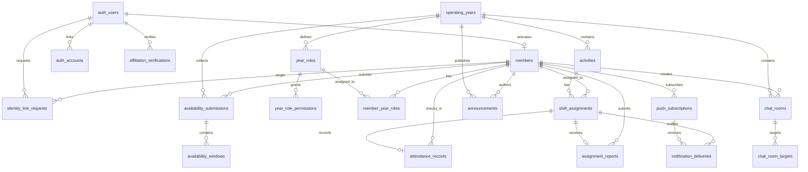

# Database

この文書は実装済みの認証・シフト・chat・push schemaを示す。D1実装の正は`packages/db/src/schema.ts`とSQL migration、Durable Object実装の正は`apps/api/src/durable-objects/chat-room.ts`とする。

## Policy

- DB は Cloudflare D1 を使う
- ORM は Drizzle を使う
- 時刻は Unix epoch milliseconds で保存する
- 年度をまたいで使うため、年度に依存するデータには `year` を持たせる
- Better Auth が必要とする `user`、`session`、`account` などの core schema は Better Auth に合わせる
- Better Auth `user` は認証主体、`members` は onboarding 済みの旭祭シフトのアカウントとして分離する
- `members.student_id` と `members.user_id` はそれぞれ unique とし、アカウントと学籍番号を 1:1 にする
- OAuth identity は Better Auth `account` として保持する。初期版は Discord 1 件、将来は 1 人の `user` に複数 provider を連携できる
- application ID は `crypto.randomUUID()` で生成する

認証関連 table は `packages/db/src/auth-schema.ts` と `packages/db/src/schema.ts` を正とする。既存の placeholder `members` table を作り直す `0001` migration は、対象 DB の `members` が 0 件であることを確認してから適用する。

## User Management

### `members`

| Column         | Type    | Note                                         |
| -------------- | ------- | -------------------------------------------- |
| `id`           | text    | PK                                           |
| `user_id`      | text    | unique FK, Better Auth `user.id`             |
| `display_name` | text    | 本名                                         |
| `student_id`   | text    | unique、`COLLATE NOCASE`、正規化済み学籍番号 |
| `access_level` | text    | `system_admin`, `leader`, `member`           |
| `created_at`   | integer | UNIX time milliseconds                       |
| `updated_at`   | integer | UNIX time milliseconds                       |

Better Auth `user` が存在しても `members` がなければ onboarding 中とする。通常 API は `members` の存在を必須とし、作成直後の `access_level` は `member` とする。

`student_id` は `^\d{2}[A-Z]{2}\d{3}$` を満たす canonical value だけを保存する。API で Unicode NFKC 正規化、trim、大文字化を行い、DB の case-insensitive unique index でも重複を防ぐ。入学年度と学科コードは必要になった時点で `student_id` から導出し、同じ情報を別 column に重複保存しない。

### Better Auth `account`

初期版は 1 つの Better Auth `user` に Discord identity を 1 件連携する。`(provider_id, account_id)` を unique とし、同じ provider identity が複数 user へ紐づかないようにする。schema は将来の複数 provider に対応できる。OAuth token は Better Auth の token encryption を有効にして保存する。

暗黙の email linking は使わない。provider 追加は将来拡張とする。

### `affiliation_verifications`

| Column                | Type    | Note                          |
| --------------------- | ------- | ----------------------------- |
| `id`                  | text    | PK                            |
| `user_id`             | text    | FK, Better Auth `user.id`     |
| `provider_id`         | text    | 初期版は `discord`            |
| `provider_account_id` | text    | provider 内の stable identity |
| `organization_id`     | text    | Discord server ID             |
| `verified_at`         | integer | 最終所属確認時刻              |
| `created_at`          | integer | UNIX time milliseconds        |
| `updated_at`          | integer | UNIX time milliseconds        |

`(provider_id, provider_account_id)` を unique とする。access/refresh token 自体はこの table に重複保存しない。

### `identity_link_requests`

学籍番号が既存だった場合の管理者復旧に使う。申請だけで identity を移動せず、承認処理は監査ログ、旧Discord identityの解除、新しい検証済みidentityの移動、申請者と対象memberの全session失効を1つのD1 batchで行う。対象member本人による自己承認は禁止する。

| Column              | Type    | Note                                           |
| ------------------- | ------- | ---------------------------------------------- |
| `id`                | text    | PK                                             |
| `requester_user_id` | text    | FK, onboarding 中の Better Auth `user.id`      |
| `target_member_id`  | text    | FK, `members.id`                               |
| `status`            | text    | `pending`, `approved`, `rejected`, `cancelled` |
| `decided_by`        | text    | FK, `members.id`, nullable                     |
| `created_at`        | integer | UNIX time milliseconds                         |
| `decided_at`        | integer | UNIX time milliseconds, nullable               |

### `admin_audit_logs`

`system_admin` の昇格、identity recovery、role 変更、全session失効などの管理操作を理由付きで記録する。初回管理者昇格も公開 bootstrap API を使わず、Cloudflare operator が既存 member を特定して D1 上で実行し、この table に同じ操作 ID の監査記録を残す。通常の管理操作は更新と監査recordをD1 batchにまとめ、どちらか一方だけが成立しないようにする。

### `operating_years`

`year`自体を識別子兼表示値として、編集状態（`draft`, `active`, `archived`）と作成・更新日時だけを保持する。年度に開始日・終了日は設けず、年度をまたぐ準備・運用を妨げない。年度依存tableの親となり、archived年度へのactivity・希望・割当の変更はAPIで拒否する。

| Column       | Type    | Note                          |
| ------------ | ------- | ----------------------------- |
| `year`       | integer | PK、識別子兼表示値            |
| `status`     | text    | `draft`, `active`, `archived` |
| `created_at` | integer | UNIX time milliseconds        |
| `updated_at` | integer | UNIX time milliseconds        |

### `year_roles`

| Column       | Type    | Note                       |
| ------------ | ------- | -------------------------- |
| `id`         | text    | PK                         |
| `year`       | integer | FK, `operating_years.year` |
| `name`       | text    | ロール名                   |
| `color`      | text    | 表示色                     |
| `created_at` | integer | UNIX time milliseconds     |
| `updated_at` | integer | UNIX time milliseconds     |

### `year_memberships`

`members` と年度の参加関係を独立して管理する。年度 role は参加者へ追加権限を与えるものであり、role の有無だけでは年度参加を意味しない。

| Column       | Type    | Note                               |
| ------------ | ------- | ---------------------------------- |
| `year`       | integer | 複合PK、FK, `operating_years.year` |
| `member_id`  | text    | 複合PK、FK, `members.id`           |
| `status`     | text    | `active`, `inactive`               |
| `created_at` | integer | UNIX time milliseconds             |
| `updated_at` | integer | UNIX time milliseconds             |

`inactive` への変更では年度 role、割当、希望、履歴を削除しないが、年度への通常アクセス、実効権限、割当候補からは即時に除外する。再度 `active` にすると保持していた role が再び有効になる。

導入 migration では既存動作を維持するため、既存の全年度と既存 member の組を `active` として補完する。新しく年度を作成した時点では参加者を自動追加しない。既存 member を新年度へ追加する方針は保留であり、現在は `system_admin` が明示的に追加する。

### `year_role_permissions`

年度別 role に機能権限を付与する。初期版の permission は `shift.manage`。application role の `leader` だけを根拠にシフト管理を許可せず、`system_admin` の全体権限またはこの permission を API で確認する。

### `member_year_roles`

| Column       | Type    | Note                    |
| ------------ | ------- | ----------------------- |
| `member_id`  | text    | PK, FK, `members.id`    |
| `role_id`    | text    | PK, FK, `year_roles.id` |
| `created_at` | integer | UNIX time milliseconds  |

## Shift Management

### `activities`

| Column          | Type    | Note                   |
| --------------- | ------- | ---------------------- |
| `id`            | text    | PK                     |
| `year`          | integer | 年度                   |
| `name`          | text    | 活動名                 |
| `place`         | text    | 場所                   |
| `activity_type` | text    | 種別                   |
| `starts_at`     | integer | UNIX time milliseconds |
| `ends_at`       | integer | UNIX time milliseconds |
| `color`         | text    | 表示色                 |
| `notes`         | text    | nullable               |
| `created_by`    | text    | FK, `members.id`       |
| `updated_by`    | text    | FK, `members.id`       |
| `created_at`    | integer | UNIX time milliseconds |
| `updated_at`    | integer | UNIX time milliseconds |

### `availability_submissions`

年度・member ごとの希望提出を一件保持し、`draft` または `submitted` とする。希望の具体的な時間帯は子 table に分離する。

### `availability_windows`

希望時間帯を任意の開始・終了時刻で保持する。固定の時間粒度は DB に埋め込まない。同一提出内の重複は共有 schema と API で拒否し、各行は DB の check constraint でも `starts_at < ends_at` を保証する。

### `shift_assignments`

| Column         | Type    | Note                   |
| -------------- | ------- | ---------------------- |
| `id`           | text    | PK                     |
| `activity_id`  | text    | FK, `activities.id`    |
| `member_id`    | text    | FK, `members.id`       |
| `starts_at`    | integer | UNIX time milliseconds |
| `ends_at`      | integer | UNIX time milliseconds |
| `notes`        | text    | nullable               |
| `status`       | text    | `active`, `cancelled`  |
| `created_by`   | text    | FK, `members.id`       |
| `cancelled_by` | text    | FK, nullable           |
| `cancelled_at` | integer | nullable               |
| `created_at`   | integer | UNIX time milliseconds |
| `updated_at`   | integer | UNIX time milliseconds |

割当は activity 内の時間に限定し、member の active な割当同士の重複を API の条件付き insert で防ぐ。取消は監査情報を残すため物理削除せず `cancelled` に更新する。希望時間外の割当は業務上必要になり得るため拒否せず、API が警告を返す。

### `attendance_records`

assignmentごとに本人の出勤時刻を一件保持する。`assignment_id` をuniqueにして二重出勤を防ぎ、APIはactiveな割当の本人であり、現在時刻が割当時間内の場合だけ作成する。退勤と管理者による修正履歴は未実装で、要件確定後に同じrecordへ安易に上書きせず監査可能な形で追加する。

### `assignment_reports`

割当本人による遅刻・欠勤連絡をassignmentごとに一件保持する。同じassignmentから再送した場合は内容を更新して`open`へ戻す。年度の`shift.manage`保有者は一覧を確認し、`resolved`へ変更できる。通常のチャットと分離することで未対応連絡を見失わないようにする。

### `announcements`

年度別の事務連絡を保持する。`normal` / `important` の重要度、公開日時、任意の掲載期限を持ち、削除操作は物理削除せず`archived`にする。作成・終了は年度の`shift.manage`を必要とする。

## Chat Management

### `chat_rooms`

| Column       | Type    | Note                       |
| ------------ | ------- | -------------------------- |
| `id`         | text    | PK                         |
| `year`       | integer | FK, `operating_years.year` |
| `name`       | text    | ルーム名                   |
| `status`     | text    | `active`, `archived`       |
| `created_by` | text    | FK, 作成した`members.id`   |
| `created_at` | integer | UNIX time milliseconds     |
| `updated_at` | integer | UNIX time milliseconds     |

### `chat_room_targets`

| Column        | Type    | Note                                 |
| ------------- | ------- | ------------------------------------ |
| `room_id`     | text    | 複合PK、FK, `chat_rooms.id`          |
| `target_type` | text    | 複合PK、`member`, `role`, `activity` |
| `target_id`   | text    | 複合PK、対象resourceのID             |
| `created_at`  | integer | UNIX time milliseconds               |

polymorphic targetの存在は作成APIで検証する。閲覧・送信時は現在のmember、年度role、active assignmentと照合するため、対象から外れた利用者の権限は即時に失効する。

### `ChatRoom` Durable Object SQLite

ルームIDをDurable Object名として1ルームを1インスタンスへ割り当てる。各object内の`messages` tableは次を持つ。

| Column                | Type    | Note                     |
| --------------------- | ------- | ------------------------ |
| `sequence`            | integer | PK、自動増分、表示順     |
| `id`                  | text    | unique、client生成UUID   |
| `member_id`           | text    | 送信時点の`members.id`   |
| `member_display_name` | text    | 送信時点の表示名snapshot |
| `content`             | text    | 本文                     |
| `created_at`          | integer | UNIX time milliseconds   |

D1との分散transactionは作らない。WorkerがD1でアクセスを検証してからDurable Object RPCを呼び、メッセージを先に永続化する。client生成IDにより、応答喪失後の同一送信を安全に再試行できる。

## Push Notifications

### `push_subscriptions`

| Column            | Type    | Note                     |
| ----------------- | ------- | ------------------------ |
| `id`              | text    | PK                       |
| `member_id`       | text    | FK, `members.id`         |
| `endpoint`        | text    | unique、Push service URL |
| `expiration_time` | integer | nullable                 |
| `p256dh`          | text    | 公開鍵                   |
| `auth`            | text    | 認証シークレット         |
| `created_at`      | integer | UNIX time milliseconds   |
| `updated_at`      | integer | UNIX time milliseconds   |

endpointはPush serviceのcapability URLとして扱い、ログへ出さない。同一endpointを別memberへ上書きすることはできない。Push serviceが404/410を返した購読は削除する。

### `notification_deliveries`

| Column            | Type    | Note                             |
| ----------------- | ------- | -------------------------------- |
| `assignment_id`   | text    | 複合PK、FK                       |
| `subscription_id` | text    | 複合PK、FK                       |
| `kind`            | text    | 複合PK、`assigned`, `ten_minute` |
| `status`          | text    | `claimed`, `sent`                |
| `claimed_at`      | integer | UNIX time milliseconds           |
| `sent_at`         | integer | nullable                         |

配送前に`INSERT OR IGNORE`でclaimし、同一通知の並行・重複送信を防ぐ。一時的な送信失敗ではclaimを削除して次回実行に再試行させる。process停止の境界では重複より未送信を選ぶat-most-once寄りの設計とする。

## ER Diagram

## Open Questions

- 場所の master table を作るか
- 既読管理をどの粒度で持つか
- application role と機能別 role の permission matrix
