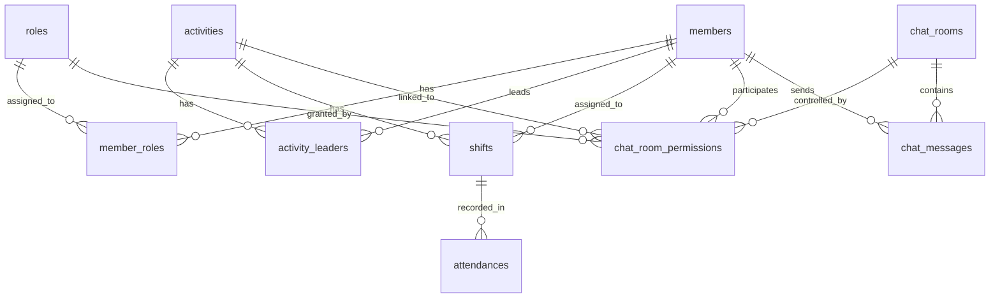

# Database

## Policy

- DB は Cloudflare D1 を使う
- ORM は Drizzle を使う
- 時刻は UNIX time milliseconds で保存する
- 年度をまたいで使うため、年度に依存するデータには `year` を持たせる
- Better Auth が必要とする `user`、`session`、`account` などの core schema は Better Auth に合わせる

## User Management

### `members`

| Column | Type | Note |
| --- | --- | --- |
| `id` | text | PK, cuid |
| `user_id` | text | FK, Better Auth `user.id` |
| `display_name` | text | 本名 |
| `student_id` | text | 学籍番号 |
| `is_system_admin` | integer | boolean |
| `created_at` | integer | UNIX time milliseconds |
| `updated_at` | integer | UNIX time milliseconds |

### `roles`

| Column | Type | Note |
| --- | --- | --- |
| `id` | text | PK, cuid |
| `year` | integer | 年度 |
| `name` | text | ロール名 |
| `color` | text | 表示色 |
| `created_at` | integer | UNIX time milliseconds |
| `updated_at` | integer | UNIX time milliseconds |

### `member_roles`

| Column | Type | Note |
| --- | --- | --- |
| `member_id` | text | PK, FK, `members.id` |
| `role_id` | text | PK, FK, `roles.id` |
| `created_at` | integer | UNIX time milliseconds |

## Shift Management

### `activities`

| Column | Type | Note |
| --- | --- | --- |
| `id` | text | PK, cuid |
| `year` | integer | 年度 |
| `place` | text | 場所 |
| `activity_type` | text | 種別 |
| `start_at` | integer | UNIX time milliseconds |
| `end_at` | integer | UNIX time milliseconds |
| `color` | text | 表示色 |
| `created_at` | integer | UNIX time milliseconds |
| `updated_at` | integer | UNIX time milliseconds |

### `activity_leaders`

| Column | Type | Note |
| --- | --- | --- |
| `id` | text | PK, cuid |
| `activity_id` | text | FK, `activities.id` |
| `member_id` | text | FK, `members.id`, nullable |
| `role_id` | text | FK, `roles.id`, nullable |

### `shifts`

| Column | Type | Note |
| --- | --- | --- |
| `id` | text | PK, cuid |
| `activity_id` | text | FK, `activities.id` |
| `member_id` | text | FK, `members.id` |
| `start_at` | integer | UNIX time milliseconds |
| `end_at` | integer | UNIX time milliseconds |
| `created_at` | integer | UNIX time milliseconds |
| `updated_at` | integer | UNIX time milliseconds |

### `attendances`

| Column | Type | Note |
| --- | --- | --- |
| `id` | text | PK, cuid |
| `shift_id` | text | FK, `shifts.id` |
| `created_at` | integer | UNIX time milliseconds |

## Chat Management

### `chat_rooms`

| Column | Type | Note |
| --- | --- | --- |
| `id` | text | PK, cuid |
| `year` | integer | 年度 |
| `name` | text | ルーム名 |
| `is_disabled` | integer | boolean |
| `created_at` | integer | UNIX time milliseconds |
| `updated_at` | integer | UNIX time milliseconds |

### `chat_room_permissions`

| Column | Type | Note |
| --- | --- | --- |
| `id` | text | PK, cuid |
| `room_id` | text | FK, `chat_rooms.id` |
| `member_id` | text | FK, `members.id`, nullable |
| `role_id` | text | FK, `roles.id`, nullable |
| `activity_id` | text | FK, `activities.id`, nullable |
| `permission_level` | text | `read_only`, `read_write`, `admin` |
| `created_at` | integer | UNIX time milliseconds |
| `updated_at` | integer | UNIX time milliseconds |

### `chat_messages`

| Column | Type | Note |
| --- | --- | --- |
| `id` | text | PK, cuid |
| `room_id` | text | FK, `chat_rooms.id` |
| `sender_id` | text | FK, `members.id` |
| `content` | text | 本文 |
| `created_at` | integer | UNIX time milliseconds |

## Push Notifications

### `push_subscriptions`

| Column | Type | Note |
| --- | --- | --- |
| `id` | text | PK, cuid |
| `user_id` | text | FK, Better Auth `user.id` |
| `endpoint` | text | Push service URL |
| `p256dh` | text | 公開鍵 |
| `auth` | text | 認証シークレット |
| `created_at` | integer | UNIX time milliseconds |
| `updated_at` | integer | UNIX time milliseconds |

## ER Diagram

## Open Questions

- 場所の master table を作るか
- 既読管理をどの粒度で持つか
- ロール権限を DB で管理するか、アプリ側の定数で管理するか
- ロールが外れた後のチャット閲覧権限をどう扱うか
